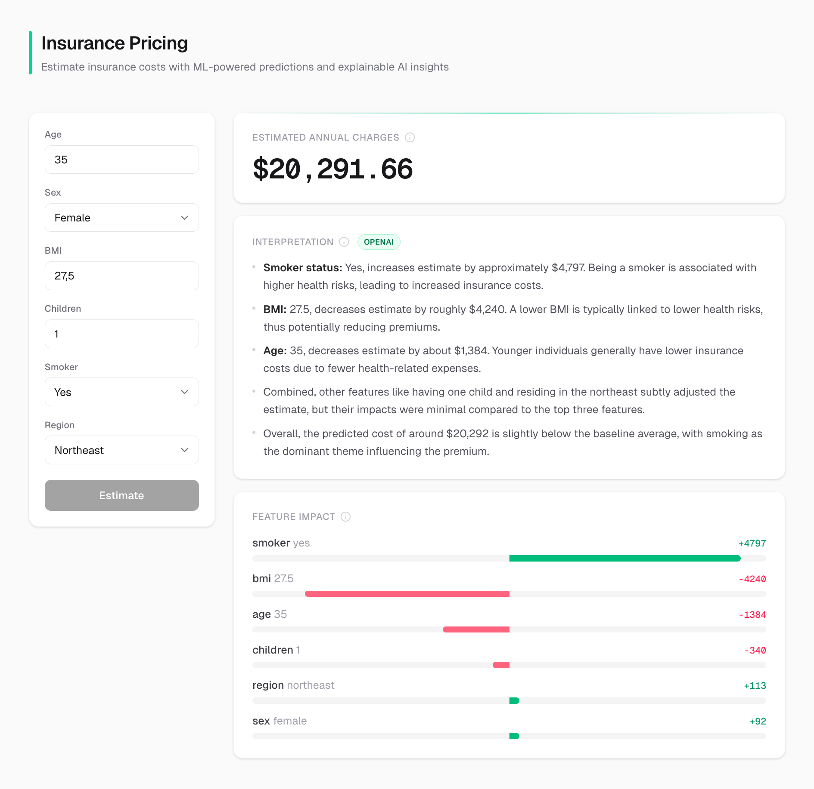

<div align="center">


# Insurance Pricing Assistant

[](https://www.python.org/downloads/)
[](https://www.typescriptlang.org/)
[](https://fastapi.tiangolo.com/)
[](https://nextjs.org/)
[](https://react.dev/)
[](https://auto.gluon.ai/stable/)
[](https://shap.readthedocs.io/)
[](https://platform.openai.com/)
[](https://www.docker.com/)

Full-stack ML application for estimating annual insurance charges with SHAP-based explainability and LLM-powered interpretation.

**[Live Demo](https://insurance-pricing.symfa.ai/)** · **[GitHub](https://github.com/Symfa-Inc/insurance-pricing)** · **[Confluence](https://symfa.atlassian.net/wiki/spaces/SYMFA/pages/5012094986)**

</div>

## Preview

<p align="center">

</p>

## Features

- **Insurance Charges Prediction** – AutoGluon tabular regression estimating annual insurance costs from demographic and health factors
- **SHAP Explainability** – Per-prediction feature contributions showing how each input affects the estimated charge
- **LLM Interpretation** – Human-readable explanation of predictions with headline, key factors, and caveats via OpenAI
- **Extrapolation Warnings** – Alerts when input values fall outside the model's training distribution
- **Model Evaluation** – Built-in reports with R², MAPE, and SMAPE metrics and business interpretation
- **EDA Reports** – Automated exploratory data analysis with visualizations in Markdown format

## How It Works

The system uses an AutoGluon TabularPredictor trained on the US Health Insurance Dataset (1,300 records with age, sex, BMI, children, smoker status, and region). When a user submits parameters, the backend runs the prediction, checks for extrapolation beyond training bounds, computes SHAP feature contributions using a TreeExplainer, and generates a structured interpretation via GPT-4o-mini. The interpretation includes a headline, bullet-point explanations of key cost drivers, and caveats about model limitations.

## Tech Stack

| Category | Technologies |
|----------|-------------|
| Backend | Python 3.13, FastAPI, Uvicorn |
| Frontend | TypeScript, Next.js, React, Tailwind CSS |
| AI/ML | AutoGluon, SHAP, OpenAI |
| Data | pandas, NumPy, scikit-learn, Pydantic |
| Package Management | uv (backend), pnpm (frontend) |
| Deployment | Docker, GitHub Actions, Google Artifact Registry |

## Getting Started

### Prerequisites

- Python 3.13+ / [uv](https://docs.astral.sh/uv/)
- Node.js 24+ / [pnpm](https://pnpm.io/)

### Installation & Running

```bash
# Backend
cd backend
cp .env.example .env          # Add your OpenAI API key
uv sync
uv run uvicorn insurance_pricing.main:app --reload

# Frontend (in a separate terminal)
cd frontend
pnpm install
pnpm dev
```

Open [http://localhost:3000](http://localhost:3000) (frontend) and [http://localhost:8000/docs](http://localhost:8000/docs) (API docs).

## License

[MIT](LICENSE)
