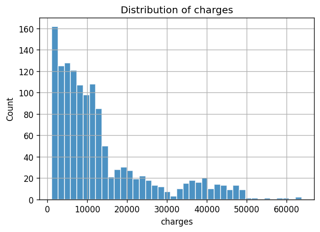
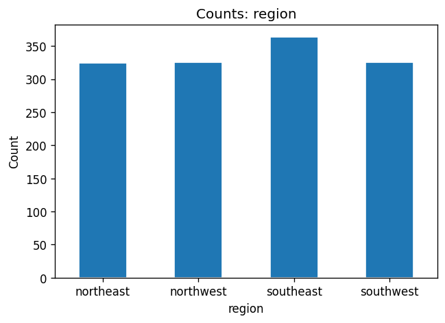
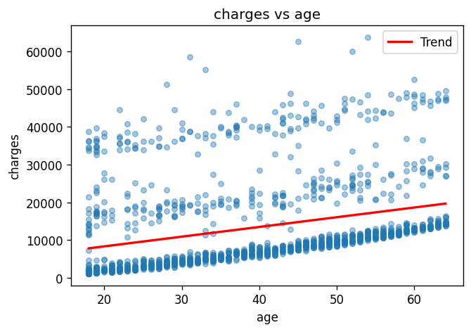
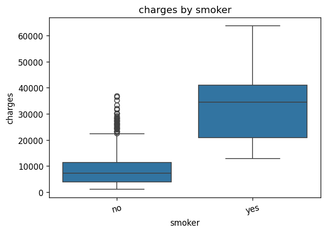

# Exploratory Data Analysis: US Health Insurance Dataset

## Dataset description

Source: `source.csv`. Features: age, sex, bmi, children, smoker, region. Target: `charges`.

## Data overview
- **Shape:** 1338 rows, 7 columns
- **Column types:**
  - `age`: int64
  - `sex`: str
  - `bmi`: float64
  - `children`: int64
  - `smoker`: str
  - `region`: str
  - `charges`: float64
- **Missing values:**
  - No missing values.

### Descriptive statistics

|  | age | sex | bmi | children | smoker | region | charges |
| --- | --- | --- | --- | --- | --- | --- | --- |
| count | 1338.0 | 1338 | 1338.0 | 1338.0 | 1338 | 1338 | 1338.0 |
| unique | nan | 2 | nan | nan | 2 | 4 | nan |
| top | nan | male | nan | nan | no | southeast | nan |
| freq | nan | 676 | nan | nan | 1064 | 364 | nan |
| mean | 39.207 | nan | 30.6634 | 1.0949 | nan | nan | 13270.4223 |
| std | 14.05 | nan | 6.0982 | 1.2055 | nan | nan | 12110.0112 |
| min | 18.0 | nan | 15.96 | 0.0 | nan | nan | 1121.8739 |
| 25% | 27.0 | nan | 26.2962 | 0.0 | nan | nan | 4740.2872 |
| 50% | 39.0 | nan | 30.4 | 1.0 | nan | nan | 9382.033 |
| 75% | 51.0 | nan | 34.6938 | 2.0 | nan | nan | 16639.9125 |
| max | 64.0 | nan | 53.13 | 5.0 | nan | nan | 63770.428 |

## Univariate analysis

### age

The age distribution has a mean of 39.21 years, indicating that the average age of the population is just over 39 years. The standard deviation of 14.05 suggests a moderate spread of ages around the mean, with a range from a minimum of 18 years to a maximum of 64 years. This indicates that while the majority of individuals are likely clustered around the mean, there is a significant presence of both younger and older individuals within the population.

### bmi

The distribution of the Body Mass Index (BMI) variable has a mean of 30.66, indicating that the average BMI is in the overweight category. The standard deviation of 6.10 suggests a moderate spread of values around the mean. The minimum BMI recorded is 15.96, which is significantly low and may indicate underweight individuals, while the maximum BMI of 53.13 indicates the presence of individuals classified as severely obese. Overall, the data reflects a range of BMI values with a tendency towards higher values, as suggested by the mean being above the normal weight threshold.

### children

The distribution of the variable 'children' has a mean of 1.09 and a standard deviation of 1.21, indicating that on average, individuals have just over one child. The minimum value is 0, suggesting that some individuals do not have any children, while the maximum value is 5, indicating that the highest number of children reported is five. The relatively high standard deviation compared to the mean suggests variability in the number of children among individuals, with some having significantly more than the average.

### charges

The distribution of 'charges' has a mean of 13270.42 and a standard deviation of 12110.01, indicating a significant spread around the mean. The minimum value is 1121.87, while the maximum is 63770.43, suggesting a wide range of charges. The relatively high standard deviation compared to the mean implies that there are substantial variations in the charges, with some values being much higher or lower than the average.

### sex

The distribution of the 'sex' variable shows a slight predominance of males, with 676 males (50.5%) compared to 662 females (49.5%). This indicates a relatively balanced gender ratio within the dataset, with males outnumbering females by 14 individuals.

### smoker

The distribution of the 'smoker' variable indicates that a majority of individuals, 1064 (79.5%), are non-smokers, while a smaller portion, 274 (20.5%), are smokers. This suggests a significantly higher prevalence of non-smokers in the dataset compared to smokers.

### region

The distribution of the 'region' variable shows that the southeast has the highest count at 364, followed by the southwest and northwest, both with 325, and the northeast with the lowest count at 324. This indicates a relatively balanced distribution among the regions, with the southeast having a notable lead in counts.

## Bivariate analysis

### Relationship between charges and each feature

#### age

The Pearson correlation coefficient of 0.2990 indicates a moderate positive correlation between age and charges, suggesting that as age increases, charges tend to increase as well. The p-value of 4.8867e-29 indicates that this correlation is statistically significant, implying that the likelihood of observing such a correlation by random chance is extremely low.

#### bmi

The Pearson correlation coefficient of 0.1983 indicates a weak positive correlation between body mass index (BMI) and medical charges, suggesting that as BMI increases, medical charges tend to increase slightly as well. The p-value of 2.4591e-13 indicates that this correlation is statistically significant, meaning there is strong evidence to reject the null hypothesis of no correlation between the two variables.

#### children

The Pearson correlation coefficient of 0.0680 indicates a very weak positive correlation between the number of children and charges. The p-value of 1.2852e-02 suggests that this correlation is statistically significant at the 0.05 level, meaning there is evidence to suggest a relationship exists, albeit weak, between the two variables.

#### sex

The data indicates that the mean charges for females are $12,569.58, while for males, the mean charges are higher at $13,956.75. This suggests that, on average, males incur greater charges than females. The counts of individuals are relatively similar, with 662 females and 676 males, indicating a comparable sample size for both sexes in this analysis.

#### smoker

The data indicates that individuals who do not smoke have a mean charge of $8,434.27, while those who do smoke have a significantly higher mean charge of $32,050.23. This suggests that smoking is associated with higher medical charges, with smokers incurring charges that are approximately 3.8 times greater than non-smokers. The counts of individuals in each category are 1,064 non-smokers and 274 smokers.

#### region

The mean charges vary by region, with the southeast region having the highest average charge at $14,735.41, followed by the northeast at $13,406.38, the northwest at $12,417.58, and the southwest at $12,346.94. The southeast region also has the highest count of observations at 364, while the northeast, northwest, and southwest regions have counts of 324, 325, and 325, respectively. This indicates that regional differences exist in average charges, with the southeast consistently showing higher mean charges compared to the other regions.

### Correlation matrix (numeric variables)

|  | age | bmi | children | charges |
| --- | --- | --- | --- | --- |
| age | 1.0 | 0.1093 | 0.0425 | 0.299 |
| bmi | 0.1093 | 1.0 | 0.0128 | 0.1983 |
| children | 0.0425 | 0.0128 | 1.0 | 0.068 |
| charges | 0.299 | 0.1983 | 0.068 | 1.0 |

## Hypotheses testing

### Effect of smoking on charges

- **Null (H0):** Mean charges are equal for smokers and non-smokers.
- **Alternative (H1):** Mean charges differ between smokers and non-smokers.
- **Test:** Welch two-sample t-test
- **Test statistic:** 32.7519
- **p-value:** 5.8895e-103

**Interpretation:** The mean value for smokers is 32,050.23, while the mean for non-smokers is 8,434.27. The p-value is 5.8895e-103, which is significantly lower than the common alpha level of 0.05. Therefore, we reject the null hypothesis (H0). This indicates that there is a statistically significant difference between the means of the two groups, suggesting that smoking is associated with higher mean values compared to non-smoking.

### Relationship between BMI and charges

- **Null (H0):** No linear correlation between BMI and charges (rho = 0).
- **Alternative (H1):** There is a linear correlation between BMI and charges (rho ≠ 0).
- **Test:** Pearson correlation test
- **Test statistic:** 0.1983
- **p-value:** 2.4591e-13

**Interpretation:** The correlation coefficient of 0.1983 indicates a weak positive relationship between the two variables being analyzed. The p-value of 2.4591e-13 is significantly less than the common alpha level of 0.05, which allows us to reject the null hypothesis (H0). This means there is strong evidence to suggest that a statistically significant correlation exists between the two variables.

### Regional differences in charges

- **Null (H0):** Mean charges are equal across all regions.
- **Alternative (H1):** At least one region has a different mean charge.
- **Test:** One-way ANOVA
- **Test statistic:** 2.9696
- **p-value:** 3.0893e-02

**Interpretation:** The analysis indicates that the mean values by region are as follows: Northeast (13,406.38), Northwest (12,417.58), Southeast (14,735.41), and Southwest (12,346.94). The F-statistic is 2.9696, and the p-value is 0.030893.

Since the p-value (0.030893) is less than the common significance level of 0.05, we reject the null hypothesis (H0). This suggests that there are statistically significant differences in the means of the regions.

## Data preparation insights

1. **Encoding:** One-hot encode `region` and binary-encode `sex` and `smoker` for linear/tree models; consider target encoding for tree-based models if needed.

2. **Scaling:** Standardize or min-max scale `age`, `bmi`, and `charges` (target) if using gradient-based or distance-sensitive models.

3. **Outliers:** Inspect `charges` and `bmi` for extreme values (e.g., IQR rule); consider winsorization or robust scaling for stability.

4. **Feature interactions:** Add interaction terms such as `smoker * bmi` and `age * bmi` to capture non-additive effects suggested by EDA.

5. **Target:** Log-transform `charges` if modeling with MSE to reduce right-skew impact and heteroscedasticity.

## Conclusion

The exploratory data analysis of the US Health Insurance dataset reveals that smoking status is a significant predictor of healthcare charges, with a p-value of 5.8895e-103 indicating a strong association. Additionally, there is a notable correlation between Body Mass Index (BMI) and healthcare charges, supported by a p-value of 2.4591e-13. The analysis of variance (ANOVA) across different regions shows a statistically significant difference in charges, with a p-value of 3.0893e-02. Overall, smoking and BMI are key drivers of healthcare charges, and regional differences also play a role in charge variability.
